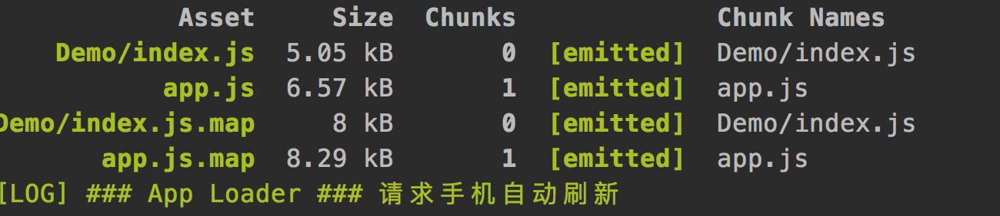

###  hap-toolkit工具编译过程


#### 1、npm run build

```javascript
const file = normalise(`${toolsPath}/webpack.config.js`)
commandRun(`${c('cross-env')} NODE_PLATFORM=na NODE_PHASE=dv ${c('webpack')} --config ${file}`)

// 打印命令
// $/demo/node_modules/.bin/cross-env NODE_PLATFORM=na NODE_PHASE=dv 
// $/demo/node_modules/.bin/webpack --config 
// $/demo/node_modules/hap-toolkit/tools/webpack.config.js
```


#### 开发环境(development)和生产环境(production)

* NODE_PLATFORM=na  

* NODE_PHASE=dv  // 为什么不是NODE_ENV=dv


```javascript
const nodeConf = function parseEnv () {
  const config = {
    // 平台：na
    NODE_PLATFORM: process.env.NODE_PLATFORM,
    // 阶段: dv|qa|ol
    NODE_PHASE: process.env.NODE_PHASE,
    // 是否注入测试框架
    NODE_TEST: process.env.NODE_TEST
  }
  colorconsole.info(`配置环境：${JSON.stringify(config)}`)
  return config
}
...
// 环境配置
if (nodeConf.NODE_PHASE === 'dv') {
  // 开发：sourcemap
  if (!options.envDisableSourceMap) {
    webpackConf.devtool = 'source-map'
  }
}
else {
  // 正式：压缩去重
  webpackConf.plugins.push(new webpack.optimize.DedupePlugin())
  webpackConf.plugins.push(new webpack.optimize.UglifyJsPlugin())
}
```


### 1.1、分析 webpack.config.js 配置文件 

- Webpack.config.js 主要有： 

    ```javascript
    const webpackConf = {
    entry: zipPages // 多文件入口配置
    module: {rules: []}, // loader模块
    plugins：[] // 插件
    ...
    output: {
        path: pathBuild,
        filename: '[name]'
      }
    }
    ```

*zipPages对象配置的多个入口，每个入生成一chunk; chunk的名称是zipPages对新键值对的中key值*


* zipPages：构造多文件入口配置
  
```javascript
      { 'About/index.js': '/Users/chenyong/Work/project/cardTest/src/demo/src/About/index.ux?uxType=page',
        'Demo/index.js': '/Users/chenyong/Work/project/cardTest/src/Demo/index.ux?uxType=page',
        'DemoDetail/index.js': '/Users/chenyong/Work/project/cardTest/src/DemoDetail/index.ux?uxType=page',
        'app.js': '/Users/chenyong/Work/project/cardTest/src/app.ux?uxType=app' }
        // JSON对象的key代表输出path,value代表输入path(携带文件type类型参数，留作后面使用)
<<<<<<< HEAD
```




### posthock

```javascript
  // 加载配置
  loadWebpackConfList(webpackConf)
    findModuleList (parentDir)
	// parentDir=$/demo01/node_modules/hap-toolkit/tools
	// 返回moduleList = ['debugger', 'packager','server']
  // 通过loadWebpackConfList() 执行如下path路径下的webpack.config.js的postHook方法，收集添加loader和plugin
  [ { name: 'debugger',
      path: haptoolkit },
    { name: 'packager',
      path: haptoolkit },
    { name: 'server',
      path: haptoolkit },
    { name: '$/demo/config' } // 预留配置，用于项目额外的配置
  ]
```

=======
      ```

    * module: {rules: []} + plugins:[] 加载loader模块

      ```javascript
        // 加载配置
        loadWebpackConfList(webpackConf)
        // 通过loadWebpackConfList() 执行如下path路径下的webpack.config.js的postHook方法，收集添加loader和plugin
        [ { name: 'debugger',
            path: haptoolkit },
          { name: 'packager',
            path: haptoolkit },
          { name: 'server',
            path: haptoolkit },
          { name: '', $/demo/config' } // 预留配置，用于项目额外的配置
        ]
      ```

    * [webpackConf.devtool](https://webpack.docschina.org/configuration/devtool) = 'source-map' 配置suorce-map：便于跟踪错误和警告

      ```javascript
        // 环境配置
        if (nodeConf.NODE_PHASE === 'dv') {
          // 开发：sourcemap
          if (!options.envDisableSourceMap) {
            webpackConf.devtool = 'source-map'
          }
        }
        else {
          // 正式：压缩去重
          webpackConf.plugins.push(new webpack.optimize.DedupePlugin())
          webpackConf.plugins.push(new webpack.optimize.UglifyJsPlugin())
        }
      ```
>>>>>>> 90be54a040f7e12123cd826bdf649fbffdcaed41


* [webpackConf.devtool](https://webpack.docschina.org/configuration/devtool) = 'source-map' 配置suorce-map：便于跟踪错误和警告

```javascript
    // 环境配置
    if (nodeConf.NODE_PHASE === 'dv') {
      // 开发：sourcemap
      if (!options.envDisableSourceMap) {
        webpackConf.devtool = 'source-map'
      }
    }
    else {
      // 正式：压缩去重
      webpackConf.plugins.push(new webpack.optimize.DedupePlugin())
      webpackConf.plugins.push(new webpack.optimize.UglifyJsPlugin())
    }
```

###  1.2、执行loader

完成webpack.config.js配置后，开始loader的执行

初始化时有两个基本loader: 

* 处理ux文件的ux-loader

* 处理js文件的： module-loader.js、babel-loader


#### 1.3 执行plugin

* new webpack.DefinePlugin() // 定义环境变量
* new ResourcePlugin()   // 
* new ZipPlugin() // 压缩代码
* new webpack.LoaderOptionsPlugin()