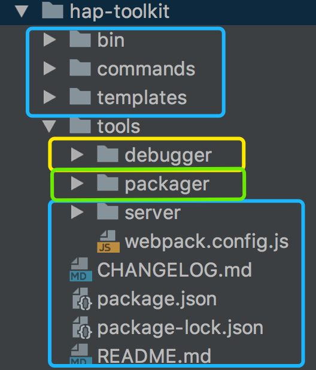

##  打包hap-toolkit工具

进入tools/toolkit目录：

执行命令： node build-all.js "../debugger"  "../packager"  "../toolkit"

>  Bash build.sh

Build.sh 主要完成的事情：

- eslint代码检查

- bable: es6转es5

- uglify: 压缩代码（压缩到dist目录）

> 项目拷贝

蓝色：toolkit中的内容        黄色：debugger中的内容         绿色: packager中的内容

