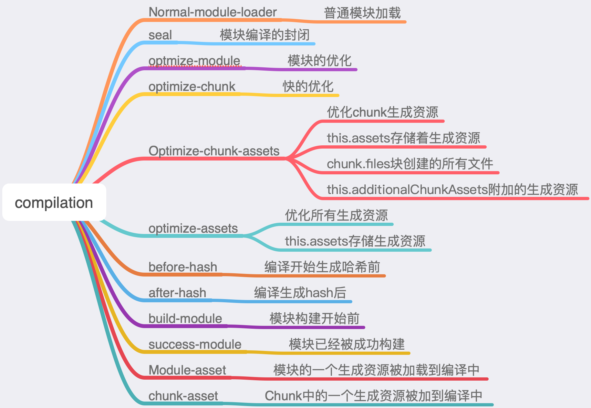

## [编写一个loader](https://webpack.js.org/api/loaders/)


A loader is a node module exporting a function.

loader是一个node module:

```javascript
module.exports = function(source) {
  return source;
};
```

### loader优化的几个要点：


* 缓存加速: 在loader中设置this.cacheable将资源缓存起来，从而提高编译效率

* ```javascript
  // 让 Loader 缓存
  module.exports = function(source) {
      this.cacheable();
      return source;
  };
  ```


* 异步

  ```JavaScript
  // 让 Loader 异步
  module.exports = function(source) {
  // 告诉 Webpack 本次转换是异步的，Loader 会在 callback 中回调结果
      var callback = this.async();
      // 做异步的事
      doSomeAsyncOperation(content, function(err, result) {
          if(err) return callback(err);
          callback(null, result);
      });
  };
  ```


* 利用好loader中this

  This中包含当前loader中的Api

  * 获取loader传递参数

    ```javascript
    const loaderUtils = require('loader-utils');
    module.exports = function(source) {
      // 获取到用户给当前 Loader 传入的 options
      const options = loaderUtils.getOptions(this);
      return source;
    };
    ```

* 返回其他结果

  处理sourceMap的情况

  ```javascript
  module.exports = function (source) {
      // 通过this.callback告诉webpack返回的结果
      thihs.callback(null, source, sourceMap);
      // 当使用this.callback返回内容时，该loader必须返回undefined，
      // 以让webpack知道Loader返回的结果在this.callback中，而不是return中
      return;
  }
  ```


### loader中常用的api

* `this.context`: 当前处理文件的所在目录，假如当前 Loader 处理的文件是 `/src/main.js`，则 `this.context`就等于 `/src`
* `this.resource`: this.resource`：当前处理文件的完整请求路径，包括 querystring，例如 `/src/main.js?name=1
* `this.resourcePath`: 当前处理文件的路径，例如 `/src/main.js`
* `this.resourceQuery`: 当前处理文件的 querystring
* `this.resolve`: 像 `require` 语句一样获得指定文件的完整路径，使用方法为 `resolve(context: string, request: string, callback: function(err, result: string))`

[更多](https://webpack.js.org/api/loaders/)


### [compilation](https://webpack.docschina.org/api/compiler-hooks/) 事件钩子




### loader常用工具

* #### [loader-utils](https://github.com/webpack/loader-utils#readme): 常用于解析loader的参数

  * #### `getOptions`

  * #### `parseQuery`


### 调试本地loader的方法

* 传统方式： 通过npm发包后安装

* npm link: 将不发布模块的情况下，将本地的一个正在开发的模块的源码链接到node_module目录下

   完成npm link的步骤：

  * 1、确保正在开发的本地Npm模块的package.json已经正确配置好

  * 2、在本地的Npm模块目录下执行`npm link `,将本地模块注册到全局

  * 3、在项目的更目录下执行 `npm link loader-name`，将2步注册到全局的本地npm 模块链接到项目的node_modules下，`loader-name`为步骤1在package.json中配置的模块名

链接好后和就像正常安装的npm模块一样
